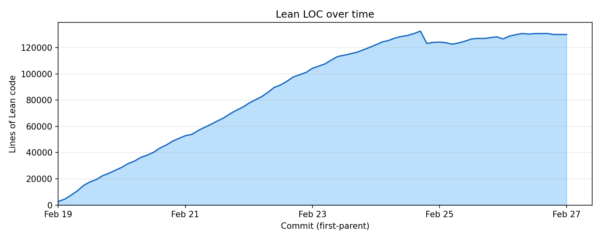
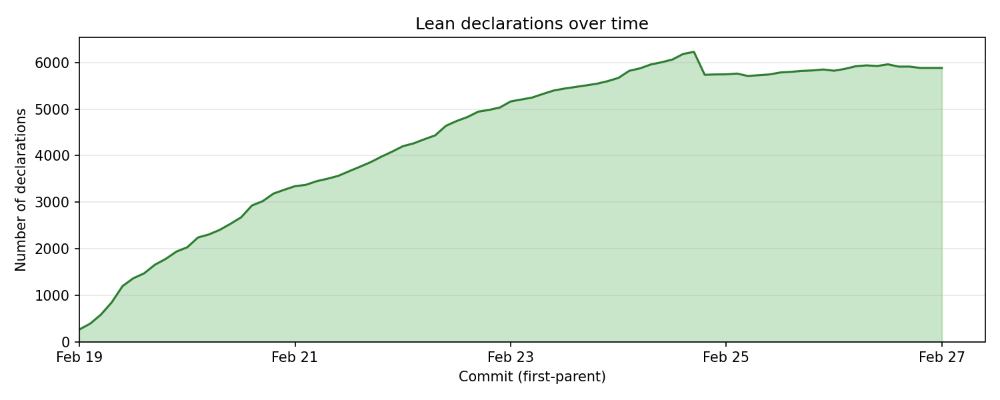
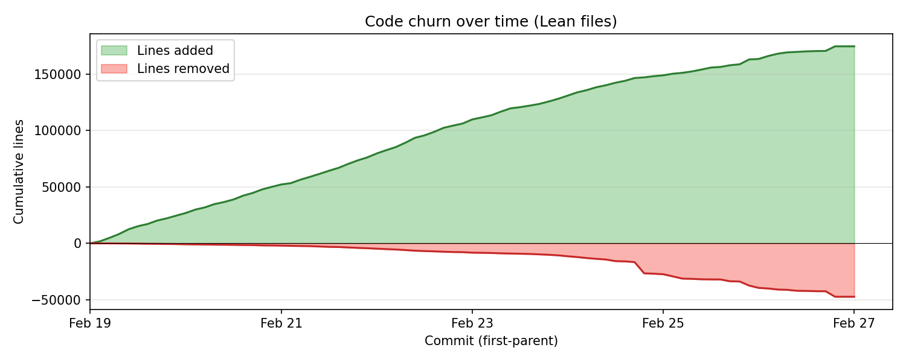
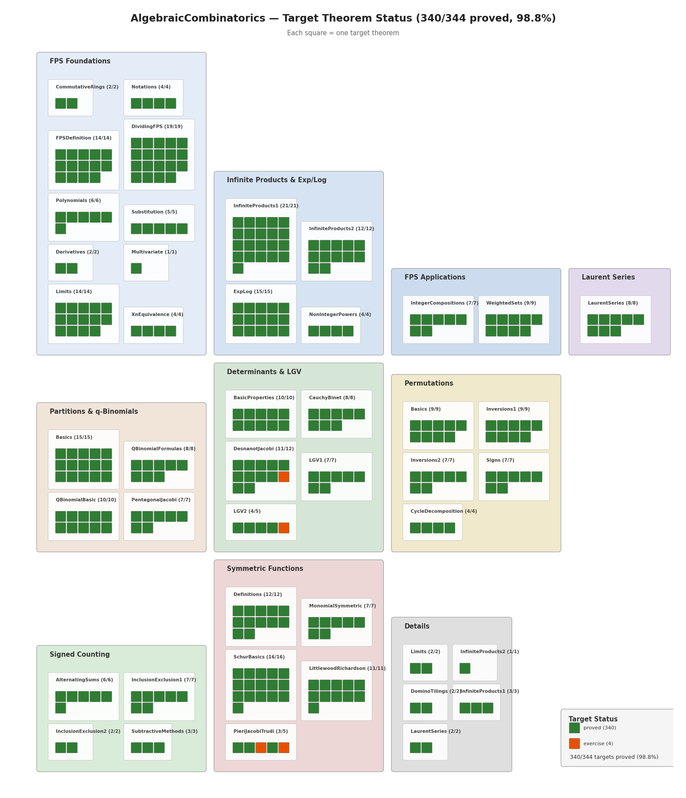

# Formalization of *Algebraic Combinatorics*

[](https://faabian.github.io/algebraic-combinatorics/)
[](https://github.com/facebookresearch/algebraic-combinatorics/blob/main/blueprint/print/print.pdf)
[](https://github.com/facebookresearch/repoprover/blob/main/auto_textbook_formalization.pdf)
[](https://github.com/facebookresearch/repoprover/)

A Lean 4 formalization of the textbook [**An Introduction to Algebraic
Combinatorics**](https://arxiv.org/abs/2506.00738) by Darij Grinberg, built on Mathlib.
The formalization proves 340 target theorems across 45 chapters, from formal power
series and integer partitions through permutations, determinants, and symmetric
functions. Every theorem whose proof appears in the textbook has been fully formalized;
4 additional targets are correctly identified as exercises (proofs deferred to the reader).


## License

This project is licensed under the Creative Commons Attribution-NonCommercial 4.0
International License. See the [LICENSE](LICENSE) file for details.

## Overall Statistics

| | | | |
|---|---|---|---|
| Target theorems | 340 | Lean source files | 52 |
| Lines of Lean code | ~130,000 | Lean declarations | ~5,900 |

### Growth

Lines of Lean code over time:



Lean declarations (theorems, lemmas, definitions) over time:



Cumulative lines added and removed:



Target theorem status — each square is one of the 340 proved targets (the 4 last ones are exercises and were not attempted)



---

## Codebase Structure

```
AlgebraicCombinatorics/
├── FPS/                          # Formal power series (Ch. 3)
│   ├── CommutativeRings.lean         Commutative ring reminders
│   ├── NotationsExamples.lean        Notations + examples (Ch. 2.3, 3.1)
│   ├── Polynomials.lean              Polynomial rings
│   ├── Substitution.lean             Substitution and evaluation
│   ├── Derivatives.lean              Derivatives of FPS
│   ├── ExpLog.lean                   Exponentials and logarithms
│   ├── NonIntegerPowers.lean         Non-integer powers
│   ├── IntegerCompositions.lean      Integer compositions
│   ├── XnEquivalence.lean            x^n-equivalence
│   ├── InfiniteProducts.lean         Infinite products: properties
│   ├── InfiniteProducts1.lean        Infinite products: details part 1
│   ├── InfiniteProducts2.lean        Infinite products: product rules
│   ├── WeightedSets.lean             Generating function of weighted sets
│   ├── Limits.lean                   Limits of FPS
│   ├── Multivariate.lean             Multivariate FPS
│   └── LaurentSeries.lean            Laurent series (FPS namespace)
├── FPSDefinition.lean            # FPS ring definition (Ch. 3.2-3.6)
├── DividingFPS.lean              # Dividing FPS, Newton binomial (Ch. 3.7)
├── LaurentSeries.lean            # Laurent and doubly-infinite series (Ch. 3.14)
│
├── Partitions/                   # Integer partitions (Ch. 4)
│   ├── Basics.lean                   Partition basics, generating functions
│   └── QBinomialFormulas.lean        q-binomial formulas + limits
├── QBinomialBasic.lean           # q-binomial basic properties (Ch. 4.4)
├── PentagonalJacobi.lean         # Pentagonal theorem + Jacobi triple product (Ch. 4.2-4.3)
│
├── Permutations/                 # Permutations (Ch. 5)
│   ├── Basics.lean                   Definitions, transpositions, cycles
│   ├── Inversions1.lean              Inversions + Lehmer codes
│   ├── Inversions2.lean              More about lengths and simples
│   ├── Signs.lean                    Signs of permutations
│   └── CycleDecomposition.lean       Cycle decomposition
│
├── SignedCounting/               # Signed counting (Ch. 6.1-6.3)
│   ├── AlternatingSums.lean          Cancellations in alternating sums
│   ├── InclusionExclusion1.lean      Inclusion-exclusion
│   ├── BooleanMobiusInversion.lean   Boolean Möbius inversion
│   └── SubtractiveMethods.lean       More subtractive methods
│
├── DeterminantsBasic.lean        # Determinants: basic properties (Ch. 6.4.1-6.4.2)
├── CauchyBinet.lean              # Cauchy-Binet + factoring (Ch. 6.4.3-6.4.5)
├── DesnanotJacobi.lean           # Desnanot-Jacobi + Cauchy det (Ch. 6.4.6-6.4.8)
├── Determinants/                 # LGV lemma (Ch. 6.5)
│   ├── LGV1.lean                     Definitions + k paths
│   ├── LGV2.lean                     Weighted + nonpermutable
│   └── PermFinset.lean               (support) permutation images of finsets
│
├── SymmetricFunctions/           # Symmetric functions (Ch. 7)
│   ├── Definitions.lean              Definitions, fundamental theorem
│   ├── MonomialSymmetric.lean        Monomial symmetric polynomials
│   ├── SchurBasics.lean              Schur polynomials, skew Schur
│   ├── LittlewoodRichardson.lean     Littlewood-Richardson rule
│   ├── PieriJacobiTrudi.lean         Pieri rules + Jacobi-Trudi
│   ├── NPartition.lean               (support) N-partition shared defs
│   ├── SSYTEquiv.lean                (support) SSYT equivalence
│   └── OmegaInvolution.lean          (support) omega involution
│
├── Details/                      # Appendix B: omitted details
│   ├── DominoTilings.lean            Domino tilings
│   ├── DominoBridge.lean             (support) domino bridge
│   ├── InfiniteProducts2.lean        Infinite products details
│   └── Limits.lean                   Limits details
│
├── Fin/SkipTwo.lean              # (support) Fin index utilities
└── Extra/Pfaffian.lean           # (support) Pfaffian infrastructure
```

---

## Building

See [BUILD.md](BUILD.md) for instructions on building the documentation and blueprint.

---

## Chapter-by-Chapter Status

### Chapter 2-3: FPS and Generating Functions

| Section | File | Targets | Status |
|---------|------|--------:|--------|
| Notations + Examples | NotationsExamples.lean | 4/4 | ✅ |
| Commutative Rings | CommutativeRings.lean | 2/2 | ✅ |
| FPS Definition | FPSDefinition.lean | 14/14 | ✅ |
| Dividing FPS | DividingFPS.lean | 19/19 | ✅ |
| Polynomials | Polynomials.lean | 6/6 | ✅ |
| Substitution | Substitution.lean | 5/5 | ✅ |
| Derivatives | Derivatives.lean | 2/2 | ✅ |
| Exp/Log | ExpLog.lean | 15/15 | ✅ |
| Non-Integer Powers | NonIntegerPowers.lean | 4/4 | ✅ |
| Integer Compositions | IntegerCompositions.lean | 7/7 | ✅ |
| x^n-Equivalence | XnEquivalence.lean | 4/4 | ✅ |
| Infinite Products (properties) | InfiniteProducts.lean | 21/21 | ✅ |
| Infinite Products (rules) | InfiniteProducts2.lean | 12/12 | ✅ |
| Weighted Sets | WeightedSets.lean | 9/9 | ✅ |
| Limits | Limits.lean | 14/14 | ✅ |
| Laurent Series | LaurentSeries.lean | 8/8 | ✅ |
| Multivariate FPS | Multivariate.lean | 1/1 | ✅ |

### Chapter 4: Partitions and q-Binomials

| Section | File | Targets | Status |
|---------|------|--------:|--------|
| Partition Basics | Basics.lean | 15/15 | ✅ |
| Pentagonal + Jacobi Triple Product | PentagonalJacobi.lean | 7/7 | ✅ |
| q-Binomial (basic) | QBinomialBasic.lean | 10/10 | ✅ |
| q-Binomial (formulas) | QBinomialFormulas.lean | 8/8 | ✅ |

### Chapter 5: Permutations

| Section | File | Targets | Status |
|---------|------|--------:|--------|
| Basics + Transpositions | Basics.lean | 9/9 | ✅ |
| Inversions + Lehmer | Inversions1.lean | 9/9 | ✅ |
| Lengths + Simples | Inversions2.lean | 7/7 | ✅ |
| Signs | Signs.lean | 7/7 | ✅ |
| Cycle Decomposition | CycleDecomposition.lean | 4/4 | ✅ |

### Chapter 6: Signed Counting and Determinants

| Section | File | Targets | Status |
|---------|------|--------:|--------|
| Alternating Sums | AlternatingSums.lean | 6/6 | ✅ |
| Inclusion-Exclusion | InclusionExclusion1.lean | 7/7 | ✅ |
| Boolean Möbius | BooleanMobiusInversion.lean | 2/2 | ✅ |
| Subtractive Methods | SubtractiveMethods.lean | 3/3 | ✅ |
| Det Basic Properties | DeterminantsBasic.lean | 10/10 | ✅ |
| Cauchy-Binet | CauchyBinet.lean | 8/8 | ✅ |
| Desnanot-Jacobi | DesnanotJacobi.lean | 11/12 | 🟡 1 exercise |
| LGV (definitions) | LGV1.lean | 7/7 | ✅ |
| LGV (weighted) | LGV2.lean | 4/5 | 🟡 1 exercise |

### Chapter 7: Symmetric Functions

| Section | File | Targets | Status |
|---------|------|--------:|--------|
| Definitions | Definitions.lean | 12/12 | ✅ |
| Monomial Symmetric | MonomialSymmetric.lean | 7/7 | ✅ |
| Schur Polynomials | SchurBasics.lean | 16/16 | ✅ |
| Littlewood-Richardson | LittlewoodRichardson.lean | 11/11 | ✅ |
| Pieri + Jacobi-Trudi | PieriJacobiTrudi.lean | 3/5 | 🟡 2 exercise |

### Appendix B: Omitted Details

| Section | File | Targets | Status |
|---------|------|--------:|--------|
| Infinite Products (part 1) | InfiniteProducts1.lean | 3/3 | ✅ |
| Infinite Products (part 2) | InfiniteProducts2.lean | 1/1 | ✅ |
| Domino Tilings | DominoTilings.lean | 2/2 | ✅ |
| Limits | Limits.lean | 2/2 | ✅ |
| Laurent Series | LaurentSeries.lean | 2/2 | ✅ |

---

## Original Work

The formalization uses Mathlib for foundational infrastructure: the `PowerSeries` ring
and its arithmetic, `MvPolynomial`, `Matrix.det` and its basic properties (transpose,
triangular, row operations, `det_mul`), `Equiv.Perm` and the sign homomorphism, and
`Nat.Partition` basics. The FPS definition wraps `PowerSeries` with the textbook's
notation, and a few determinant results (Vandermonde, Cauchy-Binet) reformulate Mathlib
theorems.

The bulk of the formalization is original work, including among others:

- **Formal power series theory**: infinite products and multipliability,
  x^n-equivalence, limits and convergence criteria, substitution into infinite
  products, the Exp-Log group isomorphism via ODE uniqueness, non-integer powers,
  Laurent and doubly-infinite power series
- **Partition theory**: generating function identities, odd-distinct bijection,
  q-binomial coefficients (recursion, quotient formulas, q-Vandermonde,
  subspace counting, limits), pentagonal number theorem, Euler's partition
  recurrence
- **Jacobi triple product**: two independent proofs (Borcherds' states/energy
  approach in `ℚX` and the `(ℤ[z^±])[[q]]` approach), including the full
  State/excitedState bijection machinery
- **Permutations**: inversions, Lehmer codes and their bijection with
  permutations, reduced word characterization, cycle decomposition (existence
  and uniqueness)
- **Signed counting**: cancellation lemmas, inclusion-exclusion (size and
  weighted versions), derangement counting, Euler's totient via inclusion-exclusion,
  Boolean Möbius inversion, q-Lucas theorem
- **Determinants**: Desnanot-Jacobi identity (via MvPolynomial + FractionRing,
  avoiding `ring` on large matrices), Jacobi's complementary minor formula,
  det(A+B) expansion, multi-row Laplace expansion
- **LGV lemma**: full weighted version for DAGs with lattice path applications,
  non-intersecting path characterization, binomial determinant nonnegativity,
  Catalan-Hankel determinants
- **Symmetric functions**: monomial symmetric polynomials and the m-basis,
  Schur and skew Schur polynomials, Bender-Knuth involutions (cell-level
  parenthesis-matching formulation, row-weak/column-strict preservation,
  involutivity, content swap), Stembridge involutions (matching-based prefix
  BK, content transposition), the Littlewood-Richardson rule (Zelevinsky
  version), Jacobi-Trudi formula for h via LGV
- **Domino tilings**: height-3 rectangle classification, tiling decomposition
  bijection, weighted set generating functions
